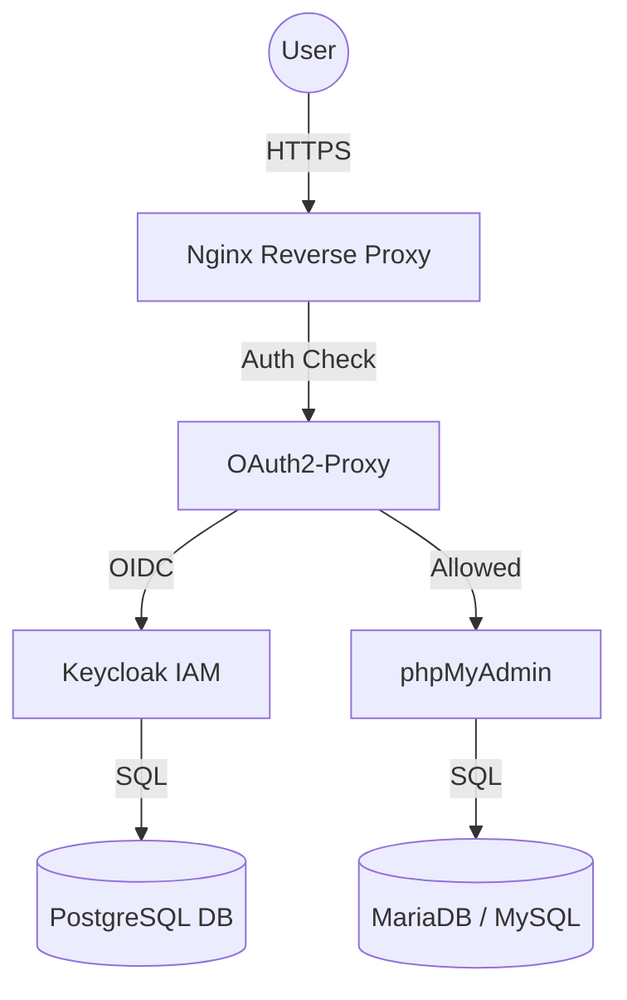

# Secure phpMyAdmin with MFA & Keycloak

**Project Name:** `secure-phpmyadmin-access`

This project deploys a secure, containerized **phpMyAdmin** instance protected by:
- **Nginx Reverse Proxy** with SSL/TLS (Let's Encrypt).
- **Keycloak** for Identity and Access Management (IAM).
- **OAuth2-Proxy** for enforcing authentication before access.
- **MFA (TOTP)** required for all users.

## Architecture



## Prerequisites

- Ansible 2.9+
- Ubuntu 20.04/22.04/24.04 Target Host
- Domain Name pointed to the host (e.g., `pma.demo.okay.cm`, `auth.demo.okay.cm`)

## Directory Structure

- `inventory/`: Host definitions.
- `group_vars/`: Configuration variables.
  - `all/vars.yml`: General configuration (Ports, Versions).
  - `all/vault.yml`: Encrypted secrets.
- `playbooks/`: Ansible playbooks.
- `roles/`: Ansible roles for modular deployment.

## Deploying

1.  **Clone the repository**.
2.  **Setup Secrets**:
    The project uses Ansible Vault. Create a `.vault_pass` file with the vault password.
    ```bash
    echo "YOUR_VAULT_PASSWORD" > .vault_pass
    ```
3.  **Run the Playbook**:
    ```bash
    ansible-playbook -i inventory/hosts.ini site.yml --vault-password-file .vault_pass
    ```

## Secrets Management

Secrets are stored in `group_vars/all/vault.yml`. To edit them:
```bash
ansible-vault edit group_vars/all/vault.yml --vault-password-file .vault_pass
```

## Access & MFA Setup

1.  **Keycloak Admin Console**: `https://auth.yourdomain.com/` (User: `admin`)
2.  **Access phpMyAdmin**: `https://pma.yourdomain.com/`
    *   **Step 1: MFA Gate** (Keycloak)
        *   Login with **Username**: `pma_admin` (Managed in Ansible)
        *   **First Login**: Setup Mobile Authenticator (OTP). Scan QR code and enter code.
    *   **Step 2: Database Login** (phpMyAdmin)
        *   After passing MFA, you will see the phpMyAdmin login screen.
        *   Log in using your **Database Credentials** (e.g., `root` and the `mysql_root_password` defined in vault).

## Troubleshooting

- **Invalid Code (MFA)**: Ensure your Authenticator App time matches the server time. The server tolerates a small window of drift.
- **500 Error**: Check Keycloak logs: `docker logs devops-pma-secure-keycloak-1`.
